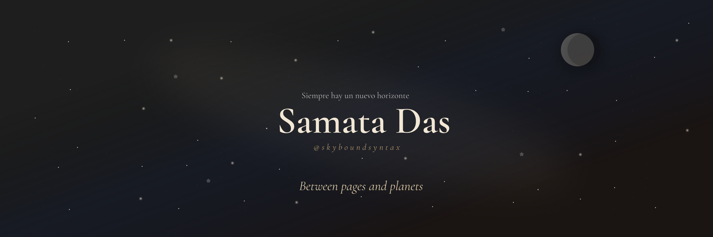
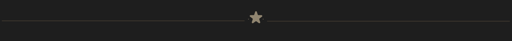

  

 

> *"Siempre hay un nuevo horizonte."*

 

## ❦ The Prologue
I enjoy building thoughtful software,
collecting quiet ideas,
and learning one concept at a time.

Most evenings you'll probably find me somewhere
between debugging code,
reading another book,
or looking up at the night sky.

Currently studying Computer Science (AI & ML),
exploring full-stack development,
machine learning,
and systems that solve real problems.

## ☾ This Season
Currently Reading

→ Clean Code

Learning

→ React
 
→ Node.js
→ Machine Learning
→ DSA

Building

→ Quiet software.

→ Thoughtful systems.

→ Small ideas,
grown with patience.

 

 

## ✧ Celestial Atlas

Still charting unfamiliar skies.

Every lesson redraws the map.

Not every journey needs a destination—
only a reason to keep looking upward.

## ✦ Constellation

The tools I return to most often.

 

## ⌘ Marginalia

"Curiosity has always taken me
further than certainty."

✦

I collect books
the same way I collect ideas:
slowly,
and with intention.

✦

Some problems deserve faster code.

Others deserve slower thinking.

## ✧ The Observatory

*A quiet record of nights spent learning and building.*

  

## ☾ Night Garden

*Where quiet consistency leaves its trail.*

  

 

 

## 🌒 Next Horizon

Build software worth returning to.

Read more than I scroll.

Keep learning with patience.

Never lose my sense of wonder.

 

 

## ☾ Epilogue

> *There are still constellations I haven't learned by name.*
